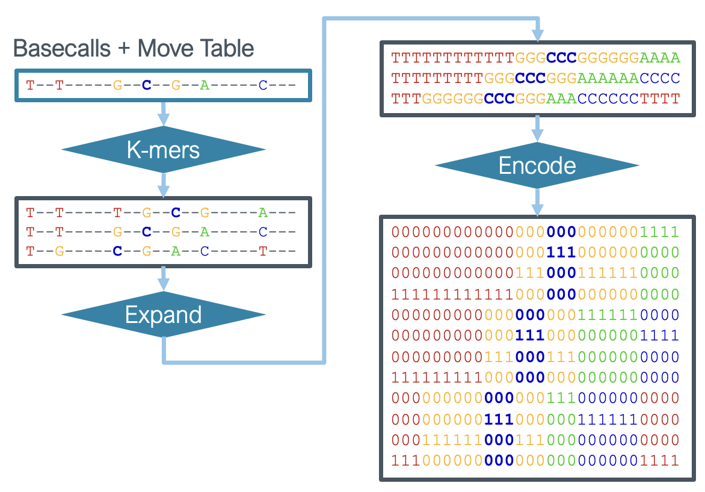
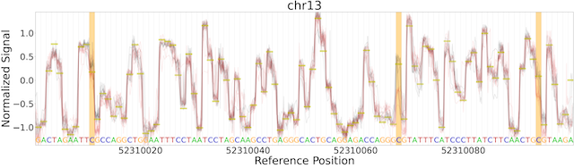
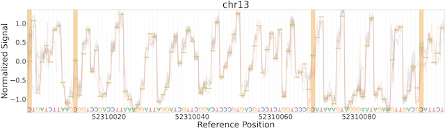

.. image:: /ONT_logo.png
  :width: 800
  :alt: [Oxford Nanopore Technologies]
  :target: https://nanoporetech.com/

Remora
""""""

Remora models predict methylation/modified base status separated from basecalling.
The Remora repository is focused on the preparation of modified base training data and training modified base models.
Some functionality for running Remora models and investigation of raw signal is also provided.
For production modified base calling use `Dorado <https://github.com/nanoporetech/dorado>`_.
For recommended modified base downstream processing use `modkit <https://github.com/nanoporetech/modkit>`_.
For more advanced modified base data preparation from "randomers" see the `Betta release community note <https://community.nanoporetech.com/posts/betta-tool-release>`_ and reach out to customer support to inquire about access (customer.support@nanoporetech.com).

Installation
------------

Install from pypi:

::

   pip install ont-remora

Install from github source for development:

::

   git clone git@github.com:nanoporetech/remora.git
   pip install -e remora/[tests]

It is recommended that Remora be installed in a virtual environment.
For example ``python3 -m venv venv; source venv/bin/activate``.

See help for any Remora sub-command with the ``-h`` flag.

Getting Started
---------------

Remora models predict modified bases anchored to canonical basecalls or reference sequence from a nanopore read.

The Remora training/prediction input unit (referred to as a chunk) consists of:

1. Section of normalized signal
2. Canonical bases attributed to the section of signal
3. Mapping between these two

Chunks have a fixed signal length defined at data preparation/model training time.
These values are saved with the Remora model to extract chunks in the same manner at inference.
A fixed position within the chunk is defined as the "focus position" around which the fixed signal chunk is extracted.
By default, this position is the center of the "focus base" being interrogated by the model.

The canonical bases and mapping to signal (a.k.a. "move table") are combined for input into the neural network in several steps.
First each base is expanded to the k-mer surrounding that base (as defined by the ``--kmer-context-bases`` hyper-parameter).
Then each k-mer is expanded according to the move table.
Finally each k-mer is one-hot encoded for input into the neural network.
This procedure is depicted in the figure below.

Data Preparation
----------------

Remora data preparation begins from a POD5 file containing signal data and a BAM file containing basecalls from the POD5 file.
Note that the BAM file must contain the move table (``--emit-moves`` in Dorado) and the MD tag (default in Dorado with mapping and ``--MD`` argument for minimap2).
If using minimap2 for alignment use ``samtools fastq -T "*" [in.bam] | minimap2 -y -ax map-ont [ref.fa] - | samtools view -b -o [out.bam]`` in order to transfer the move table tags through the alignment step since minimap2 does not support SAM/BAM input.

The following example generates training data from canonical (PCR) and modified (M.SssI treatment) samples in the same fashion as the released 5mC CG-context models.
Example reads can be found in the Remora repository (see ``test/data/`` directory).

K-mer tables for applicable conditions can be found in the `kmer_models repository <https://github.com/nanoporetech/kmer_models>`_.

.. code-block:: bash

  remora \
    dataset prepare \
    can_reads.pod5 \
    can_mappings.bam \
    --output-path can_chunks \
    --refine-kmer-level-table levels.txt \
    --refine-rough-rescale \
    --motif CG 0 \
    --mod-base-control
  remora \
    dataset prepare \
    mod_reads.pod5 \
    mod_mappings.bam \
    --output-path mod_chunks \
    --refine-kmer-level-table levels.txt \
    --refine-rough-rescale \
    --motif CG 0 \
    --mod-base m 5mC

The above commands each produce a core Remora dataset stored in the directory defined by ``--output-path``.
Core datasets contain memory mapped numpy files for each core array (chunk data) and a JSON format metadata config file.
These memory mapped files allow efficient access to very large datasets.

Before Remora, 3.0 datasets were stored as numpy array dictionaries.
Updating datasets can be accomplished with the ``scripts/update_dataset.py`` script included in the repository.

Composing Datasets
******************

Core datasets (or other composed datasets) can be composed to produce a new dataset.
The ``remora dataset make_config`` command creates these config files specifying the composition of the new dataset.
When reading batches from these combined datasets, the default behavior will be to draw chunks randomly from the entire set of chunks.
This setting is useful for multiple flowcells of the same condition.

The ``--dataset-weights`` argument produces a config which generates batches with a fixed proportion of chunks from each input dataset.
This setting is useful when combining different data types, for example control and modified datasets.

In addition, the ``remora dataset merge`` command is supplied to merge datasets, copying the data into a new core Remora dataset.
This may increase efficiency of data access for datasets composed of many core datasets, but only supports the default behavior from the ``make_config`` command.

Composed dataset config files can also be specified manually.
Config files are JSON format files containing a single list, where each element is a list of two items.
The first is the path to the dataset and the second is the weight (must be a positive value).
The ``make_config`` output config file will also contain the dataset hash to ensure the contents of a dataset are unchanged, but this is an optional third field in the config.

Metadata attributes from each core dataset are checked for compatibility and merged where applicable.
Chunk raw data are loaded from each core dataset at specified proportions to construct batches at loading time.
In a break from Remora <3.0, datasets allow "infinite iteration", where each core dataset is drawn from indefinitely and independently to supply training chunks.
For validation from a fixed set of chunks, finite iteration is also supported.

Model Training
--------------

Models are trained with the ``remora model train`` command.
For example a model can be trained with the following command.

.. code-block:: bash

  remora \
    model train \
    train_dataset.jsn \
    --model remora/models/ConvLSTM_w_ref.py \
    --device 0 \
    --output-path train_results

This command will produce a "best" model in torchscript format for use in Bonito, ``remora infer``, or ``remora validate`` commands.
Models can be exported for use in Dorado with the ``remora model export`` command.

Model Inference
---------------

For testing purposes inference within Remora is provided.
Note that for large scale using the exported Dorado model during basecalling is recommended.

.. code-block:: bash

  remora \
    infer from_pod5_and_bam \
    can_signal.pod5 \
    can_mappings.bam \
    --model train_results/model_best.pt \
    --out-file can_infer.bam \
    --device 0
  remora \
    infer from_pod5_and_bam \
    mod_signal.pod5 \
    mod_mappings.bam \
    --model train_results/model_best.pt \
    --out-file mod_infer.bam \
    --device 0

Finally, Remora provides tools to validate these results.
Ground truth `BED files <http://useast.ensembl.org/info/website/upload/bed.html>`_ reference positions where each read should be called as the modified or canonical base listed in the BED name field.
Note in the test files where the control file has a ``C`` in the name field, while the modified BED file has ``m`` (single letter code for 5mC) in the name field.

.. code-block:: bash

  remora \
    validate from_modbams \
    --bam-and-bed can_infer.bam can_ground_truth.bed \
    --bam-and-bed mod_infer.bam mod_ground_truth.bed \
    --full-output-filename validation_results.txt

Pre-trained Models
------------------

See the selection of current released models with ``remora model list_pretrained``.
Pre-trained models are stored remotely and can be downloaded using the ``remora model download`` command or will be downloaded on demand when needed.

Models may be run from `Bonito <https://github.com/nanoporetech/bonito>`_.
See Bonito documentation to apply Remora models.

More advanced research models may be supplied via `Rerio <https://github.com/nanoporetech/rerio>`_.
These files require download from Rerio and then the path to this download must be provided to Remora.
Note that older ONNX format models require Remora version < 2.0.

Python API and Raw Signal Analysis
----------------------------------

Raw signal plotting is available via the ``remora analyze plot ref_region`` command.

The ``plot ref_region`` command is useful for gaining intuition into signal attributes and visualize signal shifts around modified bases.
As an example using the test data, the following command produces the plots below.
Note that only a single POD5 file per sample is allowed as input and that the BAM records must contain the ``mv`` and ``MD`` tags (see the see "Data Preparation" section above for details).

.. code-block:: bash

  remora \
    analyze plot ref_region \
    --pod5-and-bam can_reads.pod5 can_mappings.bam \
    --pod5-and-bam mod_reads.pod5 mod_mappings.bam \
    --ref-regions ref_regions.bed \
    --highlight-ranges mod_gt.bed \
    --refine-kmer-level-table levels.txt \
    --refine-rough-rescale \
    --log-filename log.txt

The Remora API has a simple interface to access and manipulate a nanopore read including signal, basecalls, reference mapping and links between each of these.
The ``remora.io.Read`` object is the core object for joining these data types.
The ``remora.io.Read.from_pod5_and_alignment`` class method is the simplest interface to initialize the object.
This method takes ``pod5.Read`` and ``pysam.AlignedSegment`` objects as input.
Remora also provides a method to generate an in-memory index of a BAM file (``remora.io.ReadIndexedBam``) for random access by read ID.

Note that the input BAM file should contain ``mv`` (move table) and ``MD`` tags in order to access signal and reference information respectively.
See the see "Data Preparation" section above for details.

The ``notebooks/read_plotting.ipynb`` notebook included with this repository exemplifies some of the functionality provided via the ``io.Read`` object.

A ``remora.data_chunks.RemoraRead`` object can extracted from an ``io.Read`` object with the ``into_remora_read`` method.
The ``RemoraRead`` object is more specialized to contain just the information needed to create chunks for input into Remora modified base models.
The ``RemoraRead`` object can be generated from either basecalled sequence or reference sequence via the ``use_reference_anchor``.
The ``remora.inference.call_read_mods`` function runs a Remora model on a ``RemoraRead`` returning the probabilities for each modeled base and positions of those bases.

The ``remora.io.Read`` API also enables access to per-read, per-site raw signal metrics for more advanced statistical analysis.

Terms and Licence
-----------------

This is a research release provided under the terms of the Oxford Nanopore Technologies' Public Licence.
Research releases are provided as technology demonstrators to provide early access to features or stimulate Community development of tools.
Support for this software will be minimal and is only provided directly by the developers. Feature requests, improvements, and discussions are welcome and can be implemented by forking and pull requests.
Much as we would like to rectify every issue, the developers may have limited resource for support of this software.
Research releases may be unstable and subject to rapid change by Oxford Nanopore Technologies.

© 2021-2023 Oxford Nanopore Technologies Ltd.
Remora is distributed under the terms of the Oxford Nanopore Technologies' Public Licence.

Research Release
----------------

Research releases are provided as technology demonstrators to provide early access to features or stimulate Community development of tools. Support for this software will be minimal and is only provided directly by the developers. Feature requests, improvements, and discussions are welcome and can be implemented by forking and pull requests. However much as we would like to rectify every issue and piece of feedback users may have, the developers may have limited resource for support of this software. Research releases may be unstable and subject to rapid iteration by Oxford Nanopore Technologies.
